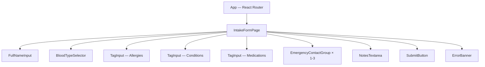

# Design Document: Emergency Card Intake Form

## Overview

The Emergency Card Intake Form is the primary data-entry interface of the "Ready Ka Ba?" app. It is a single-page React form rendered at route `/` within a Vite-based frontend application in the `/frontend` folder. Users fill out their emergency medical information — full name, blood type, allergies, conditions, medications, emergency contacts, and optional notes — and submit the data to a backend REST API. On success, the app navigates to a result page where the user receives a QR code linking to their live emergency card.

The form is built by Person 2 in a 4-person parallel development team. It must produce a JSON payload that strictly conforms to the shared data model contract so that the backend (Person 1) and the card display pages (Person 3) function seamlessly.

### Key Design Decisions

| Decision | Rationale |
|----------|-----------|
| React with Vite | Team standard; fast dev server, HMR, and ESM-native builds |
| React Router (client-side routing) | Enables SPA navigation to `/result/:id` without full page reload |
| Controlled components for all inputs | Enables real-time validation and predictable state |
| Tag input as a reusable component | Allergies, conditions, and medications share identical UX |
| Environment-variable-based API URL | Allows local dev and production deployments without code changes |
| No external form library | Form is simple enough; avoids dependency bloat |
| CSS Modules or Tailwind utility classes | Scoped styling with responsive-first approach |

## Architecture

```mermaid
graph TD
    subgraph Browser
        A[Route "/" — IntakeForm Page] --> B[FormState Hook]
        A --> C[ValidationEngine]
        A --> D[TagInput Component]
        A --> E[EmergencyContactGroup Component]
        A --> F[BloodTypeSelector Component]
        A --> G[SubmitButton Component]
    end

    B -->|valid payload| H[API Client Module]
    H -->|POST /api/cards| I[Backend API]
    I -->|201 Response with id| H
    H -->|success| J[React Router navigate to /result/:id]
    H -->|error| K[Error State Display]
```

### Data Flow

1. User fills form fields → controlled component state updates in `useFormState` hook
2. User clicks Submit → `ValidationEngine` checks required fields
3. If invalid → inline error messages rendered below respective fields
4. If valid → `APIClient.createCard(payload)` sends POST request
5. During request → loading state: button disabled, spinner shown
6. On success → extract `id` from response, navigate to `/result/:id`
7. On error → display error message, preserve form data, re-enable button

## Components and Interfaces

### Component Tree



### Component Interfaces

#### `TagInput`
```typescript
interface TagInputProps {
  label: string;
  chips: string[];
  onAddChip: (value: string) => void;
  onRemoveChip: (index: number) => void;
  maxChips: number;        // 20
  maxChipLength: number;   // 50
  error?: string;
}
```

#### `EmergencyContactGroup`
```typescript
interface EmergencyContact {
  name: string;
  relationship: string;
  phone: string;
}

interface EmergencyContactGroupProps {
  contacts: EmergencyContact[];
  onUpdateContact: (index: number, field: keyof EmergencyContact, value: string) => void;
  onAddContact: () => void;
  onRemoveContact: (index: number) => void;
  maxContacts: number;     // 3
  error?: string;
}
```

#### `BloodTypeSelector`
```typescript
interface BloodTypeSelectorProps {
  value: string;
  onChange: (value: string) => void;
  options: string[];       // ["A+", "A-", "B+", "B-", "AB+", "AB-", "O+", "O-", "Unknown"]
  error?: string;
}
```

#### `useFormState` Hook
```typescript
interface FormState {
  fullName: string;
  bloodType: string;
  allergies: string[];
  conditions: string[];
  medications: string[];
  emergencyContacts: EmergencyContact[];
  notes: string;
}

interface UseFormStateReturn {
  formState: FormState;
  setField: (field: keyof FormState, value: any) => void;
  addChip: (field: 'allergies' | 'conditions' | 'medications', value: string) => void;
  removeChip: (field: 'allergies' | 'conditions' | 'medications', index: number) => void;
  addContact: () => void;
  updateContact: (index: number, field: keyof EmergencyContact, value: string) => void;
  removeContact: (index: number) => void;
  reset: () => void;
}
```

#### `APIClient`
```typescript
interface CardPayload {
  fullName: string;
  bloodType: string;
  allergies: string[];
  conditions: string[];
  medications: string[];
  emergencyContacts: EmergencyContact[];
  notes: string;
}

interface CardResponse extends CardPayload {
  id: string;
  createdAt: string;
  updatedAt: string;
}

interface APIClient {
  createCard(payload: CardPayload): Promise<CardResponse>;
}
```

#### `ValidationEngine`
```typescript
interface ValidationErrors {
  fullName?: string;
  bloodType?: string;
  emergencyContacts?: string;
}

function validate(formState: FormState): ValidationErrors;
function hasErrors(errors: ValidationErrors): boolean;
```

## Data Models

### Form State (Client-Side)

```typescript
// Internal form state — superset of what is sent to API
interface FormState {
  fullName: string;           // max 100 chars
  bloodType: string;          // one of BLOOD_TYPE_OPTIONS or ""
  allergies: string[];        // each max 50 chars, max 20 items
  conditions: string[];       // each max 50 chars, max 20 items
  medications: string[];      // each max 50 chars, max 20 items
  emergencyContacts: EmergencyContact[];  // 1-3 items
  notes: string;              // max 500 chars, optional
}

interface EmergencyContact {
  name: string;               // max 100 chars
  relationship: string;       // max 50 chars
  phone: string;              // max 20 chars
}
```

### API Payload (Outbound)

```typescript
// Exactly matches the shared data model contract (minus server fields)
interface CardPayload {
  fullName: string;
  bloodType: string;
  allergies: string[];
  conditions: string[];
  medications: string[];
  emergencyContacts: { name: string; relationship: string; phone: string }[];
  notes: string;
}
```

### API Response (Inbound)

```typescript
interface CardResponse {
  id: string;
  fullName: string;
  bloodType: string;
  allergies: string[];
  conditions: string[];
  medications: string[];
  emergencyContacts: { name: string; relationship: string; phone: string }[];
  notes: string;
  createdAt: string;
  updatedAt: string;
}
```

### Constants

```typescript
const BLOOD_TYPE_OPTIONS = ["A+", "A-", "B+", "B-", "AB+", "AB-", "O+", "O-", "Unknown"];
const MAX_CHIPS = 20;
const MAX_CHIP_LENGTH = 50;
const MAX_CONTACTS = 3;
const MAX_FULL_NAME_LENGTH = 100;
const MAX_CONTACT_NAME_LENGTH = 100;
const MAX_RELATIONSHIP_LENGTH = 50;
const MAX_PHONE_LENGTH = 20;
const MAX_NOTES_LENGTH = 500;
const API_TIMEOUT_MS = 10_000;
const DEFAULT_API_URL = "http://localhost:3001";
```


## Correctness Properties

*A property is a characteristic or behavior that should hold true across all valid executions of a system — essentially, a formal statement about what the system should do. Properties serve as the bridge between human-readable specifications and machine-verifiable correctness guarantees.*

### Property 1: TagInput chip length and count enforcement

*For any* string value added to a TagInput (allergies, conditions, or medications), the stored chip value SHALL never exceed 50 characters, and the total number of chips in any single TagInput SHALL never exceed 20.

**Validates: Requirements 1.3, 1.4, 1.5**

### Property 2: Whitespace-only input rejection in TagInput

*For any* string composed entirely of whitespace characters (spaces, tabs, newlines, or empty string), attempting to add it as a chip to any TagInput SHALL be rejected, and the chips array SHALL remain unchanged.

**Validates: Requirements 1.6**

### Property 3: Chip removal correctness

*For any* TagInput with a non-empty chips array and any valid index within that array, removing the chip at that index SHALL reduce the array length by exactly one and the removed value SHALL no longer appear at that index position.

**Validates: Requirements 1.11, 1.12**

### Property 4: Validation rejects all invalid form states

*For any* form state where fullName is empty/whitespace-only, OR bloodType is unselected, OR no emergency contact has both a non-empty name and non-empty phone, the ValidationEngine SHALL return at least one error and the form SHALL NOT submit an API request.

**Validates: Requirements 2.1, 2.2, 2.3, 2.4**

### Property 5: Reactive error clearing on field correction

*For any* form field that currently has a validation error, when the user modifies that field to a valid value, the corresponding error message SHALL be removed without requiring a new form submission attempt.

**Validates: Requirements 2.5**

### Property 6: Payload data model conformance

*For any* valid form state that passes validation, the constructed CardPayload SHALL contain exactly the fields fullName (non-empty string), bloodType (one of the 9 allowed values), allergies (string[]), conditions (string[]), medications (string[]), emergencyContacts (array of 1-3 objects each with exactly name, relationship, and phone as strings), and notes (string) — with no additional fields (no id, createdAt, or updatedAt) and all field names in exact camelCase.

**Validates: Requirements 3.3, 8.1, 8.2, 8.3, 8.4, 8.5, 8.6, 8.7, 8.8**

### Property 7: Successful response navigates to correct route

*For any* API response with HTTP 2xx status containing a non-empty id string, the application SHALL navigate to the route "/result/{id}" where {id} matches the id value from the response.

**Validates: Requirements 4.1, 4.2**

### Property 8: Error preserves all form data

*For any* form state containing user-entered data (text fields, chips, contacts, notes) and any API error (network failure, non-2xx response, or timeout), after the error occurs all form fields SHALL retain their pre-submission values.

**Validates: Requirements 6.5**

### Property 9: Non-success HTTP status displays error

*For any* HTTP response with status code 400 or above returned from the POST request, the form SHALL display an inline error message above the submit button and SHALL re-enable the submit button for retry.

**Validates: Requirements 6.1, 6.4**

### Property 10: Accessibility label association

*For any* input field rendered in the IntakeForm, there SHALL exist a corresponding label element whose htmlFor attribute matches the input's id attribute.

**Validates: Requirements 7.5**

## Error Handling

### Validation Errors (Client-Side)

| Error Condition | User-Facing Message | Behavior |
|----------------|---------------------|----------|
| Empty/whitespace fullName | "Full name is required" | Inline below Full Name input |
| No blood type selected | "Blood type is required" | Inline below dropdown |
| No valid emergency contact | "At least one contact with name and phone is required" | Inline near contacts section |

- Errors appear on submit attempt and clear reactively when the field is corrected
- Form does not submit while any validation error exists

### API Errors (Server-Side)

| Error Condition | User-Facing Message | Behavior |
|----------------|---------------------|----------|
| HTTP 4xx response | "Submission failed. Please check your data and try again." | Inline above submit button |
| HTTP 5xx response | "Something went wrong on our end. Please try again." | Inline above submit button |
| Network error (no response) | "Unable to reach the server. Check your connection and try again." | Inline above submit button |
| Timeout (>10 seconds) | "The server is taking too long to respond. Please try again." | Inline above submit button |
| Success but missing id | "Your card was saved but we couldn't navigate to the result. Please try again later." | Inline above submit button, form data preserved |

### Error State Management

- All API errors preserve the user's entered form data
- Loading spinner is hidden and submit button re-enabled on any error
- A new submission attempt dismisses any previously displayed error message
- Error messages use a distinct but non-alarming visual style (muted red/amber text, no flashing)

## Testing Strategy

### Unit Tests (Example-Based)

Unit tests cover specific scenarios, integration points, and edge cases:

- **BloodTypeSelector**: Renders all 9 options, no default selection (Req 1.2)
- **API URL construction**: Uses VITE_API_URL when defined, defaults to localhost:3001 (Req 3.1, 3.2)
- **Content-Type header**: POST sends application/json (Req 3.4)
- **Loading state**: Button disabled and spinner shown during request (Req 5.1-5.4)
- **Timeout handling**: Shows error after 10 seconds (Req 6.2, 6.3)
- **Error dismissal**: New submission clears previous error (Req 6.6)
- **Missing id edge case**: Shows error when response has no id (Req 4.3)
- **Max contacts button**: Hidden/disabled when 3 contacts displayed (Req 1.9)

### Property-Based Tests

Property-based tests validate universal correctness properties using [fast-check](https://github.com/dubzzz/fast-check) (the standard PBT library for TypeScript/JavaScript):

| Property | Test Description | Min Iterations |
|----------|-----------------|----------------|
| Property 1 | Generate random strings, add as chips, verify length ≤ 50 and count ≤ 20 | 100 |
| Property 2 | Generate whitespace-only strings, verify rejected from chips | 100 |
| Property 3 | Generate random chip arrays + valid index, verify removal correctness | 100 |
| Property 4 | Generate invalid form states, verify validation blocks submission | 100 |
| Property 5 | Generate invalid→valid field transitions, verify error clears | 100 |
| Property 6 | Generate random valid form states, verify payload structure matches contract | 100 |
| Property 7 | Generate random non-empty id strings, verify navigation route | 100 |
| Property 8 | Generate random form states + error scenarios, verify data preservation | 100 |
| Property 9 | Generate random HTTP error status codes (400-599), verify error display | 100 |
| Property 10 | Render form, verify all inputs have associated labels | 100 |

**Configuration:**
- Library: `fast-check` (npm package)
- Runner: Vitest (bundled with Vite)
- Minimum iterations per property: 100
- Tag format: `Feature: emergency-card-intake-form, Property {N}: {description}`

### Integration Tests

- Full form submission flow with mocked API (happy path)
- Form submission with real backend in CI (if available)
- Responsive layout testing at breakpoints: 320px, 768px, 1024px, 1440px
- Accessibility audit with axe-core or similar tool

### Test File Structure

```
frontend/
├── src/
│   ├── components/
│   │   ├── TagInput.tsx
│   │   ├── TagInput.test.tsx          # Unit + property tests
│   │   ├── BloodTypeSelector.tsx
│   │   ├── BloodTypeSelector.test.tsx # Unit tests
│   │   ├── EmergencyContactGroup.tsx
│   │   └── EmergencyContactGroup.test.tsx
│   ├── hooks/
│   │   ├── useFormState.ts
│   │   └── useFormState.test.ts       # Property tests for state management
│   ├── lib/
│   │   ├── validation.ts
│   │   ├── validation.test.ts         # Property tests for validation
│   │   ├── api-client.ts
│   │   └── api-client.test.ts         # Unit tests with mocked fetch
│   ├── pages/
│   │   ├── IntakeFormPage.tsx
│   │   └── IntakeFormPage.test.tsx     # Integration tests
│   └── utils/
│       ├── buildPayload.ts
│       └── buildPayload.test.ts       # Property tests for payload conformance
```
