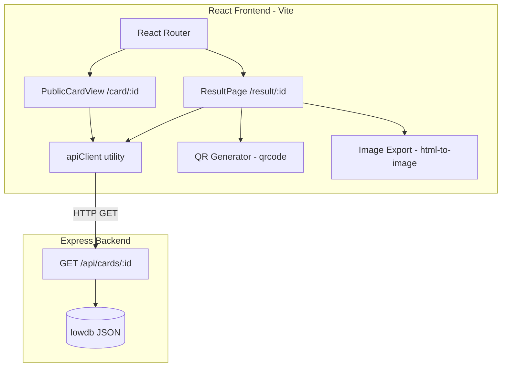
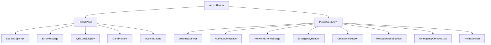

# Design Document: QR Card Display

## Overview

This feature implements two React pages for the "Ready Ka Ba?" emergency info card app:

1. **Result Page** (`/result/:id`) — Displayed after card creation. Shows a QR code encoding the public card URL, a styled card preview, a "Download as image" button (PNG export), and a "Copy link" button.

2. **Public Card View** (`/card/:id`) — The page loaded when someone scans the QR code. A read-only, mobile-optimized, zero-friction display of the cardholder's emergency information with blood type and allergies given maximum visual prominence, and tap-to-call phone links for emergency contacts.

Both pages share a common data-fetching pattern (GET `/api/cards/:id`) and rely on the existing backend API. No authentication is required for either page.

### Key Design Decisions

| Decision | Choice | Rationale |
|----------|--------|-----------|
| QR generation | `qrcode` npm package (`toDataURL`) | Specified in requirements; generates PNG data URL client-side without server round-trip |
| Image export | `html-to-image` (`toPng`) | Lighter than html2canvas, pure JS, produces high-quality PNG from DOM nodes |
| State management | Local component state (useState/useEffect) | Pages are independent; no shared global state needed |
| Routing | React Router `useParams` | Already implied by route structure `/result/:id` and `/card/:id` |
| Styling approach | CSS Modules or scoped CSS | Prevents style leakage, keeps each page self-contained |

## Architecture



### Data Flow

1. User creates card → redirected to `/result/:id`
2. ResultPage mounts → fetches card data via `apiClient` → generates QR data URL → renders card preview
3. User downloads image → `html-to-image` captures Card_Element DOM node → triggers browser download
4. User copies link → Clipboard API writes public URL → shows confirmation
5. Someone scans QR → opens `/card/:id` → PublicCardView fetches card data → renders emergency layout

## Components and Interfaces

### Shared Utilities

#### `apiClient.ts`

```typescript
const API_BASE = import.meta.env.VITE_API_URL || 'http://localhost:3001';

export interface Card {
  id: string;
  fullName: string;
  bloodType: string;
  allergies: string[];
  conditions: string[];
  medications: string[];
  emergencyContacts: EmergencyContact[];
  notes: string;
  createdAt: string;
  updatedAt: string;
}

export interface EmergencyContact {
  name: string;
  relationship: string;
  phone: string;
}

export async function fetchCard(id: string): Promise<Card> {
  const controller = new AbortController();
  const timeout = setTimeout(() => controller.abort(), 10000);

  try {
    const response = await fetch(`${API_BASE}/api/cards/${id}`, {
      signal: controller.signal,
    });

    if (response.status === 404) {
      throw new CardNotFoundError(id);
    }

    if (!response.ok) {
      throw new CardFetchError(response.status);
    }

    return await response.json();
  } finally {
    clearTimeout(timeout);
  }
}

export class CardNotFoundError extends Error {
  constructor(id: string) {
    super(`Card not found: ${id}`);
    this.name = 'CardNotFoundError';
  }
}

export class CardFetchError extends Error {
  public status: number;
  constructor(status: number) {
    super(`Failed to fetch card: HTTP ${status}`);
    this.name = 'CardFetchError';
    this.status = status;
  }
}
```

#### `qrGenerator.ts`

```typescript
import QRCode from 'qrcode';

export async function generateQRDataURL(url: string): Promise<string> {
  return QRCode.toDataURL(url, {
    width: 400,       // 2x the minimum 200px display size
    margin: 2,
    errorCorrectionLevel: 'M',
  });
}
```

#### `imageExport.ts`

```typescript
import { toPng } from 'html-to-image';

export async function exportCardAsImage(
  element: HTMLElement,
  cardId: string
): Promise<void> {
  const dataUrl = await toPng(element, {
    pixelRatio: 2, // 2x resolution for print quality
  });

  const link = document.createElement('a');
  link.download = `ready-ka-ba-card-${cardId}.png`;
  link.href = dataUrl;
  link.click();
}
```

#### `clipboardUtil.ts`

```typescript
export async function copyToClipboard(text: string): Promise<boolean> {
  if (navigator.clipboard && navigator.clipboard.writeText) {
    await navigator.clipboard.writeText(text);
    return true;
  }
  return false;
}
```

### Page Components

#### `ResultPage.tsx`

```
Props: none (reads id from useParams)
State:
  - card: Card | null
  - loading: boolean
  - error: 'not-found' | 'network' | null
  - qrDataUrl: string | null
  - qrError: boolean
  - downloading: boolean
  - downloadError: boolean
  - copied: boolean
  - copyFailed: boolean

Lifecycle:
  - On mount: validate id param → fetch card → generate QR
  - On download click: disable button → export PNG → trigger download → re-enable
  - On copy click: copy URL → show "Copied!" for 3s → reset

Sub-components:
  - LoadingSpinner
  - ErrorMessage (not-found or generic)
  - CardPreview (the styled Card_Element)
  - QRCodeDisplay
  - ActionButtons (Download + Copy)
```

#### `PublicCardView.tsx`

```
Props: none (reads id from useParams)
State:
  - card: Card | null
  - loading: boolean
  - error: 'not-found' | 'network' | null

Lifecycle:
  - On mount: validate id param → fetch card
  - On retry click: reset state → re-fetch

Sub-components:
  - LoadingSpinner
  - NotFoundMessage
  - NetworkErrorMessage (with retry button)
  - EmergencyHeader (fullName)
  - CriticalInfoSection (bloodType + allergies — large, bold, red/amber)
  - MedicalDetailsSection (conditions + medications)
  - EmergencyContactsList (tap-to-call links)
  - NotesSection
```

#### `CardPreview.tsx` (shared sub-component for Result Page)

```
Props:
  - card: Card
  - ref: React.RefObject<HTMLDivElement> (for image export targeting)

Renders:
  - Fixed-width container (350-450px)
  - White background, rounded corners, border
  - Full name header
  - Blood type + allergies in red/amber accent section (1.25x font)
  - Conditions, medications, emergency contacts, notes
  - Omits sections with no data
```

### Component Tree



## Data Models

### Card Interface (TypeScript)

```typescript
interface Card {
  id: string;
  fullName: string;
  bloodType: string;
  allergies: string[];
  conditions: string[];
  medications: string[];
  emergencyContacts: EmergencyContact[];
  notes: string;
  createdAt: string;
  updatedAt: string;
}

interface EmergencyContact {
  name: string;
  relationship: string;
  phone: string;
}
```

### Page State Models

```typescript
// Result Page state
interface ResultPageState {
  card: Card | null;
  loading: boolean;
  error: 'not-found' | 'network' | null;
  qrDataUrl: string | null;
  qrError: boolean;
  downloading: boolean;
  downloadError: boolean;
  copied: boolean;
  copyFailed: boolean;
}

// Public Card View state
interface PublicCardViewState {
  card: Card | null;
  loading: boolean;
  error: 'not-found' | 'network' | null;
}
```

### API Response Mapping

The backend `GET /api/cards/:id` returns the Card object directly on success (200). Possible responses:

| Status | Body | Frontend Interpretation |
|--------|------|----------------------|
| 200 | Card JSON | Success — render card |
| 404 | `{ error: "..." }` | Card not found |
| 500 | `{ error: "..." }` | Server error — show retry (PublicCardView) or generic error (ResultPage) |
| Network failure | — | AbortError (timeout) or TypeError — show error state |


## Correctness Properties

*A property is a characteristic or behavior that should hold true across all valid executions of a system — essentially, a formal statement about what the system should do. Properties serve as the bridge between human-readable specifications and machine-verifiable correctness guarantees.*

### Property 1: QR code encodes the correct public card URL

*For any* valid card ID and any site origin, the QR code generated on the Result Page SHALL encode a URL exactly equal to `{origin}/card/{id}`, and decoding the QR data URL back SHALL produce that same URL string.

**Validates: Requirements 2.1, 2.4**

### Property 2: Card preview renders exactly the non-empty fields

*For any* valid Card object, the CardPreview component SHALL render all fields that have non-empty values (non-empty string, non-empty array), and SHALL NOT render any section for fields that are empty (empty string or empty array).

**Validates: Requirements 3.1, 3.4**

### Property 3: Download filename matches the expected format

*For any* valid card ID string, the exported PNG download filename SHALL equal `ready-ka-ba-card-{id}.png` where `{id}` is the card's unique identifier.

**Validates: Requirements 4.4**

### Property 4: Emergency contact rendering respects phone presence

*For any* emergency contact, the Public Card View SHALL display the contact's name and relationship. IF the contact has a non-empty phone number, THEN the phone SHALL be rendered as a `tel:` hyperlink with the phone value. IF the phone is empty or missing, THEN no `tel:` link SHALL be rendered, and the name and relationship SHALL appear as plain text only.

**Validates: Requirements 8.1, 8.3, 8.5**

## Error Handling

### Result Page Error States

| Trigger | User-Facing Behavior | Technical Detail |
|---------|---------------------|-----------------|
| Missing/empty `id` param | "Card not found" message | No API call made; immediate error state |
| API returns 404 | "Card not found" message with explanation | Caught via response.status check |
| API returns 5xx | Generic "Could not load card" error | CardFetchError thrown |
| Network failure / timeout (10s) | Generic "Could not load card" error | AbortController signal fires |
| QR generation fails | Error message + fallback URL text display | `qrcode.toDataURL` rejection caught |
| Image export fails | Error message + re-enabled download button | `toPng` rejection caught |
| Clipboard API unavailable | Show URL as selectable text | Feature-detect `navigator.clipboard.writeText` |

### Public Card View Error States

| Trigger | User-Facing Behavior | Technical Detail |
|---------|---------------------|-----------------|
| API returns 404 | "Emergency card not found" message | No retry offered (card doesn't exist) |
| API returns 5xx / network failure / timeout | Error message + "Try Again" button | Retry re-triggers fetch from loading state |
| Missing/empty `id` param | "Card not found" message | No API call made |

### Error Recovery Strategy

- **Result Page**: Errors are terminal (user can navigate back to form). No retry needed since the user just created the card — if it's not found, something is fundamentally wrong.
- **Public Card View**: Network errors offer retry because the viewer (likely a first responder) may have intermittent connectivity. A retry button avoids requiring a full page reload.
- **Graceful degradation**: If QR fails, show URL text. If clipboard fails, show URL text. The user always has a path to their data.

## Testing Strategy

### Unit Tests (Example-Based)

Unit tests cover specific UI states, integration wiring, and edge cases:

- **Data fetching**: Mock API responses (200, 404, 500, timeout) and verify correct state transitions
- **Loading states**: Verify spinner appears during fetch, disappears on completion
- **Error rendering**: Verify correct error message for each error type
- **QR display**: Verify image element renders with correct alt text and minimum dimensions
- **Download button**: Verify disabled state during export, re-enabled after
- **Copy button**: Verify "Copied!" feedback appears and auto-dismisses
- **Fallback behaviors**: Missing clipboard API shows URL text; QR failure shows URL text
- **Empty field omission**: Specific examples of cards with missing optional fields
- **Blood type/allergies defaults**: "Not specified" and "None reported" when empty
- **Tap target size**: Verify phone links meet 44x44px minimum
- **Responsive layout**: No horizontal overflow at 320px viewport

### Property-Based Tests

Property-based tests verify universal correctness properties across generated inputs. Use `fast-check` as the PBT library for TypeScript/React.

Each property test runs a minimum of 100 iterations with randomly generated inputs.

| Property | Test Approach | Generator |
|----------|--------------|-----------|
| Property 1: QR URL correctness | Generate random IDs + origins, construct URL, verify format | `fc.string()` for ID, `fc.webUrl()` for origin |
| Property 2: Field rendering completeness | Generate random Card objects with various empty/non-empty combos, render, verify DOM presence | Custom `fc.record()` with optional empty arrays/strings |
| Property 3: Filename format | Generate random ID strings, verify filename matches template | `fc.string({ minLength: 1 })` for ID |
| Property 4: Contact rendering | Generate contacts with/without phone, verify tel: link presence correlates with phone presence | Custom `fc.record()` for EmergencyContact |

**Configuration:**
- Library: `fast-check` (TypeScript property-based testing)
- Minimum iterations: 100 per property
- Test tag format: `Feature: qr-card-display, Property {N}: {title}`

### Integration Tests

- Full page render with mocked API: Result Page load → QR visible → download works → copy works
- Full page render with mocked API: Public Card View load → all sections visible → phone links clickable
- Retry flow: Public Card View error → click retry → success

### Accessibility Tests

- All images have meaningful alt text
- Tap targets meet 44x44px minimum
- Color contrast ratio ≥ 4.5:1 for text
- Keyboard navigation works for all interactive elements
